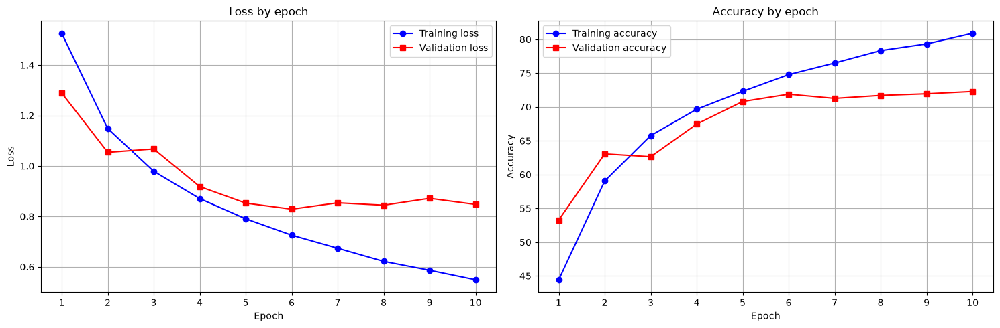
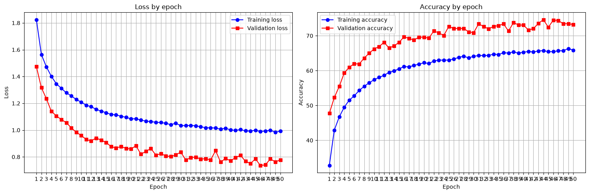

# cifar-10-cnn

**Training a convolutional neural network on the CIFAR-10 dataset using PyTorch.**

## How I am doing it
1. I downloaded the CIFAR-10 dataset from the University of Toronto.
2. I split the dataset into training/validation/testing.
3. I designed a simple model and tested it.
4. I redesigned the model to counteract overfitting. (dropout and data augmentation)

## Requirements
```
pip install -r requirements.txt
```

## Results

